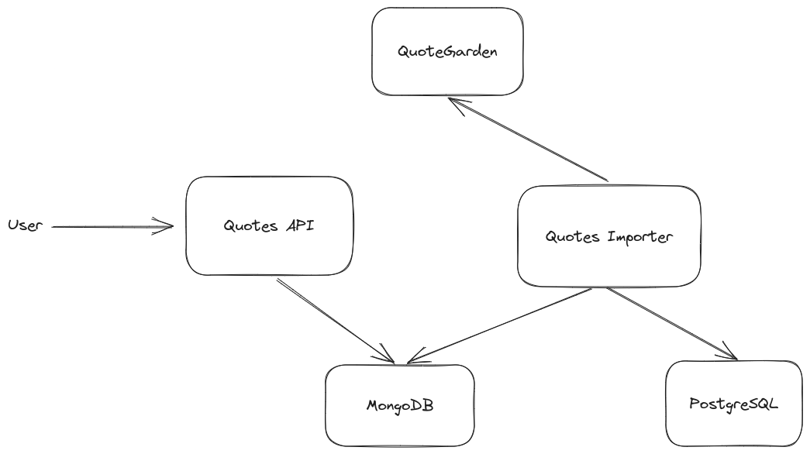

# Get-Quotes

## Description
This application is a quotes' repository. It is split in two services:
- Quotes Importer
- Quotes API

## Architecture

The application architecture is the following:



- **[QuoteGarden](https://pprathameshmore.github.io/QuoteGarden)**: Quotes source
- **Quotes Importer**: Imports quotes from QuoteGarden into MongoDB
- **MongoDB**: Database with the quotes repository
- **PostgreSQL**: Database used to save Quotes Importer state information.
- **Quotes API**: API used to search for quotes.

The Quotes Importer and Quotes API are developed in Java (version 17) and Spring Boot (version 3.1.4) and other modules such as Spring Data MongoDB. Quotes Importer uses Spring Batch, Spring JPA with PostgreSQL driver, and OpenFeign.

Since that Spring batch does not support MongoDB to save its state out of the box, a SQL database was necessary (in this case PostgreSQL).

## Pre-Requirements

To build and run this project, it is necessary:

- Java 17
- Docker
- Docker Compose

## Quotes Importer
This service is an ETL job that gathers a configured number of quotes from [QuoteGarden](https://pprathameshmore.github.io/QuoteGarden), and saves them into a MongoDB instance.

### Configuration

Excluding Spring configurations, the service's configuration properties are the following:

| Property                | Description                            |
| ----------------------- | -------------------------------------- |
| `batch.collection`      | MongoDB collection to save the quotes  |
| `batch.page-size`       | The QuoteGarden request page size      |
| `batch.max-count`       | The maximum number of quotes to import |
| `quotes-client.url`     | The QuoteGarden URL                    |

## Quotes API
This service is an API that gets the quotes imported by the Quotes Importer.

### Endpoints
To check the API's endpoints, check the [API's documentation](http://localhost:8080/swagger-ui), when this service is running.

## Run
The following commands were tested in a machine with Linux. To execute them in other OS, it is possible that some modifications are needed.

To run the Quotes API, start the containers in the `docker-compose.yml`, in the root directory:

```bash
docker compose up -d
```

After that, to start the Quotes Importer, run the following command, in the `quotes-importer` directory:

```bash
./mvnw spring-boot:run
```

## Stop & Clean

To stop the containers, run the following command in the root directory:

```bash
docker compose down
```

To remove the databases' volumes, run the command:

```bash
docker volume rm get-quotes_mongo get-quotes_postgres
```